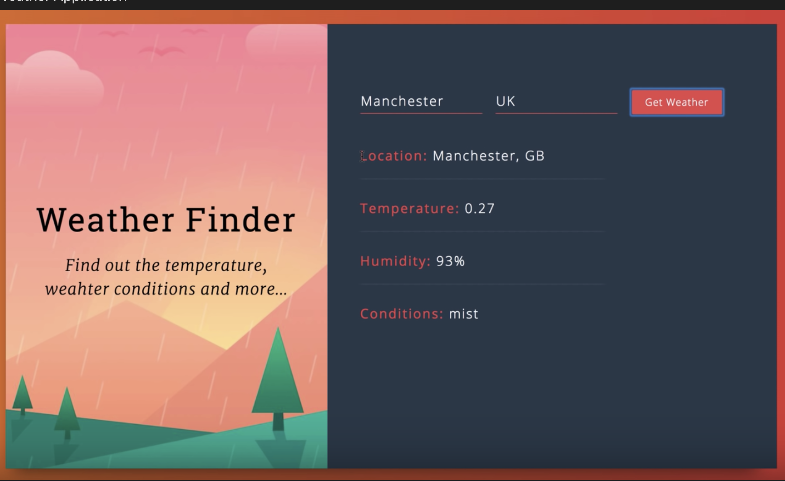

# `Weather Finder`

This is a weather finding app that takes a city and country code to get the temperature, humitidy, and weather condition.

## `Setup Steps`
1. Fork and clone this repository into your projects location 
   - `git clone git@github.com:<your github account name here>/express-api-inventory.git`
2. Create a new branch, and name it after your project. 
3. Checkout to your newly created branch.
   - `git checkout -b <your projects name here>`
4. Install dependencies in your branch by running in the terminal  
   - `npm install`.

## `Technologies Used`
- GitHub
- HTML
- CSS
- React.js
- Bootstrap 5

## `Images`
